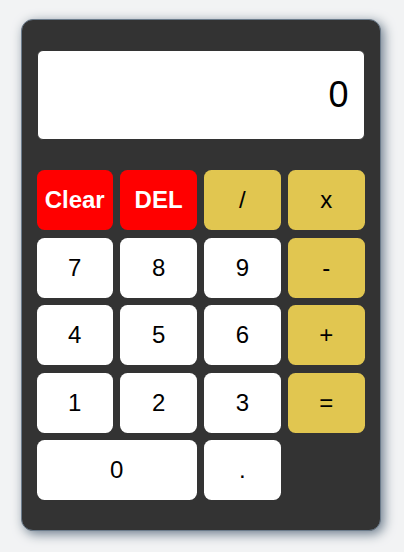

# Calculator

A web-based calculator created as the final project for **The Odin Project: Foundations Curriculum**.

## Live Demo
[View Live Calculator](https://github.com/AliouSang/calculator.git)

## Features

- Basic mathematical operations: Addition, Subtraction, Multiplication, Division.
- Chain evaluation support (e.g., `12 + 7 - 1`).
- Decimal point support with duplicate decimal prevention.
- Backspace (DEL) and Clear functionality.
- Full keyboard support (`0-9`, `/`, `*`, `+`, `-`, `Enter`, `Backspace`, `Escape`).
- Error handling for division by zero.

## Technologies Used

- **HTML5**: Semantic layout and calculator structure.
- **CSS3**: Flexbox styling, layout positioning, and interactive button states.
- **JavaScript**: Event delegation, DOM manipulation, state management, and keyboard handling.

## What I Learned

- **Separation of Concerns**: Keeping structure (HTML), styling (CSS), and core logic (JavaScript) modular and maintainable. 
- **State Management**: Managing complex user interactions (operators, consecutive clicks, dynamic displays) using clear JavaScript state variables.
- **DOM Event Delegation**: Optimizing performance by handling click events at the parent container level.
- **Integration**: Combining foundational web technologies into a single fully functional web application. 

